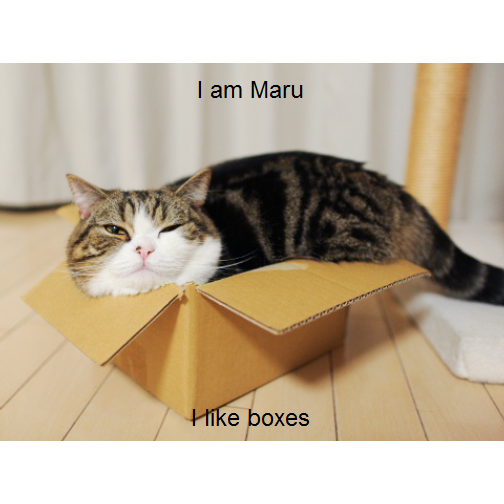
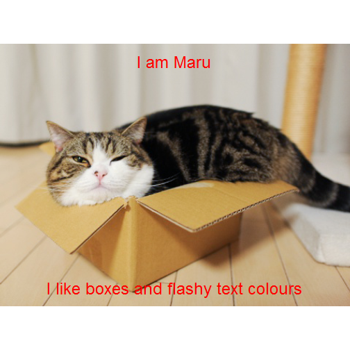

## The Meme Generator: What IS it?

Generate funny images with top- and/or bottom text captions! Included in the Meme Generator are:

* 6 predefined images, 3 cats, 3 dogs
* Possibility of uploading your own images
* Customizable captions
* Customizable text colours for text visibility
     
## How do I use it?
It's simple! To create your own personalized meme, perform the following steps:

* In the sidepanel on the left, select either "cat", "dog" or "own image" using the radio buttons.
     * If you selected "own image", make sure to use the "choose file" button to upload the image you had in mind. Unfortunately, the meme generator only supports .JPG images right now. 
     * If you selected "cat" or "dog", you can use the button labeled "Another!" to choose one of three unique funny animals.
* Once you have selected the image you wish to edit, use the text boxes to apply a caption to the top- and/or bottom of the image.
* Finally, select the text colour. Make sure your text is clearly legible!
* You are done! You have created an awesome meme!
     
## But how does it work?
The Meme Generator reads in .JPG files and displays them as graphs using the base R plotting system. The base plotting system allows the adding of text using the *text()* function, which is precisely what the key function behind the system, *plot_jpeg()*, does. The function is based on [this source](http://stackoverflow.com/questions/9543343/plot-a-jpg-image-using-base-graphics-in-r).

## How it works: Example usage of *plot_jpeg*


```r
# Example usage:
plot_jpeg("cat2.jpg", "I am Maru", "I like boxes", "black")
plot_jpeg("cat2.jpg", "I am Maru", "I like boxes and flashy text colours", "red")
```

  

## Code base and Acknowledgements
This application was created using [Shiny](http://shiny.rstudio.com/) in [RStudio](https://www.rstudio.com/). It was created as a course project for the Coursera class [Developing Data Products](https://www.coursera.org/learn/data-products), a part of the [JHU Data Science Specialization](https://www.coursera.org/specializations/jhu-data-science). You can find the code for this application on my GitHub repository: [Cats and Dogs Meme Generator](https://github.com/verhulststefanie/courseraShinyApp).

